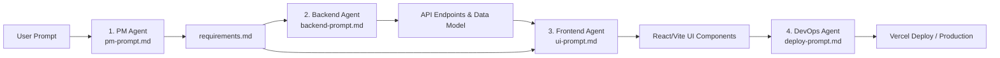

# 🛡️ AdminHub — Demo Dashboard Admin (Multi-Agent Project)

> **Catatan Penting:** Proyek ini adalah **demo/template starter** yang dibuat menggunakan pendekatan **Multi-Agent Workflow** (PM → Backend Dev → Frontend Dev → DevOps). Data yang ditampilkan adalah **dummy/statis** dan tidak terhubung ke database nyata.

---

## 🎯 Tujuan Proyek

Proyek ini dibuat sebagai **proof of concept** untuk membuktikan bahwa alur kerja multi-agen AI dapat menghasilkan proyek fullstack yang siap deploy secara otomatis — dari requirements hingga live URL.

---

## 🌐 Live Demo

**Frontend:** [https://my-dashboard-app-iota.vercel.app](https://my-dashboard-app-iota.vercel.app)
**API Endpoint:** `https://my-dashboard-app-iota.vercel.app/api/users`

---

## 🤖 Multi-Agent Architecture

Proyek ini dibangun oleh 4 peran AI agent yang dieksekusi secara berurutan:

| Agent | File Prompt | Output yang Dihasilkan |
|---|---|---|
| 📋 **Product Manager** | `.agents/pm-prompt.md` | `requirements.md` |
| ⚙️ **Backend Developer** | `.agents/backend-prompt.md` | `backend/server.js` + `backend/package.json` |
| ⚛️ **Frontend Developer** | `.agents/ui-prompt.md` | Seluruh kode di `frontend/src/` |
| 🚀 **DevOps** | `.agents/deploy-prompt.md` | `vercel.json` + `frontend/api/users.js` |

---


---

## 📖 Cara Menggunakan Multi-Agent untuk Membuat Web App Baru

Folder [`.agents/`](file:///Users/tedysuwega/Workspace/MyProject/Learn/WebApp/Autonomous-Multi-Agent-Workflow/my-dashboard-app/.agents) berisi kumpulan **spesialisasi peran prompt**. AI Agent (Antigravity IDE / Cursor / Claude) bertindak sebagai **Orchestrator** yang membaca prompt tersebut dan mengeksekusinya secara berurutan (*pipeline sequence*):



### 📋 Template Master Prompt (Copy & Paste untuk Web App Baru)

Jika Anda ingin membuat aplikasi web baru (misalnya **Expense Tracker**, **Task Manager**, dll.), cukup berikan prompt seperti di bawah ini ke AI:

```markdown
Kamu adalah agen AI pengembang perangkat lunak full-stack (AI Orchestrator). 
Tolong bangun aplikasi baru: "[NAMA APLIKASI, misal: Expense Tracker App]" dari awal menggunakan alur kerja multi-agen secara berurutan.

Deskripsi Aplikasi:
[Jelaskan ide aplikasi secara singkat, misal:
Aplikasi pencatat keuangan pribadi dengan fitur:
- Tambah, edit, dan hapus transaksi (pemasukan & pengeluaran)
- Kategori transaksi (makanan, transportasi, hiburan, dll.)
- Ringkasan total saldo, pemasukan, dan pengeluaran
- Tabel histori transaksi dan chart/grafik visual]

Silakan eksekusi langkah-langkah berikut secara berurutan:

1. Inisialisasi Peran (.agents):
   Gunakan peran-peran berikut (buat folder .agents/):
   - .agents/pm-prompt.md (Product Manager): Mengkaji ide dan menghasilkan requirements.md lengkap.
   - .agents/backend-prompt.md (Backend Dev): Membaca requirements.md, membuat server REST API (Fastify/Node.js) dengan endpoint CRUD dummy data.
   - .agents/ui-prompt.md (Frontend Dev): Membaca requirements.md, membangun UI modern (React + Vite + Vanilla CSS) dengan stats card, tabel transaksi, form modal, dan integrasi fetch API.
   - .agents/deploy-prompt.md (DevOps): Membuat konfigurasi serverless Vercel (vercel.json dan api/ handlers) agar siap live.

2. Eksekusi Pipeline (Sequence):
   - STEP 1 (PM): Jalankan peran PM untuk membuat file requirements.md.
   - STEP 2 (Backend): Jalankan peran Backend untuk membuat struktur folder backend/ dengan endpoints yang sesuai.
   - STEP 3 (Frontend): Jalankan peran UI untuk membuat project Vite + React di folder frontend/ dan menghubungkannya dengan API.
   - STEP 4 (DevOps): Setup konfigurasi vercel.json dan folder frontend/api/ untuk serverless function.

3. Validasi & Pengujian:
   - Pastikan aplikasi dapat dijalankan secara lokal (npm run dev).
   - Pastikan seluruh fitur CRUD dapat beroperasi tanpa error.
```

### 💡 Tips Eksekusi Sequence
1. **One-Shot vs Step-by-Step**: Prompt di atas bisa diberikan sekaligus (*one-shot autonomous*) karena AI memiliki kemampuan tool execution (`run_command`, `write_to_file`).
2. **Kunci Sukses Pipeline**: Output dari agen sebelumnya (terutama `requirements.md`) menjadi *single source of truth* bagi agen berikutnya (Backend & Frontend), sehingga kode yang dibuat otomatis selaras dan tidak bentrok.

## 🛠️ Tech Stack

| Layer | Teknologi |
|---|---|
| **Frontend** | React 18 + Vite |
| **Backend (Lokal)** | Node.js + Fastify |
| **Backend (Produksi)** | Vercel Serverless Functions (`frontend/api/`) |
| **Styling** | Vanilla CSS (dark theme, glassmorphism) |
| **Deployment** | Vercel (auto-deploy dari GitHub) |
| **Version Control** | Git + GitHub (SSH via `github-personal`) |

---

## ✨ Fitur Dashboard

- 📊 **Stats Cards** — Total pengguna, aktif, tidak aktif, total admin
- 👥 **Tabel Data Pengguna** — Kolom: Nama, Email, Role, Status, Tanggal Bergabung
- 🔍 **Search & Filter** — Pencarian real-time berdasarkan nama/email
- ➕ **Form Tambah Pengguna** — Modal dengan validasi input
- 📄 **Paginasi** — 10 baris per halaman
- 🔔 **Toast Notification** — Feedback saat aksi berhasil/gagal
- 🎨 **Dark UI Premium** — Glassmorphism, gradient, micro-animation

---

## 📁 Struktur Proyek

```
my-dashboard-app/
├── .agents/                    # Prompt file untuk setiap AI agent
│   ├── pm-prompt.md            # Role: Product Manager
│   ├── ui-prompt.md            # Role: Frontend Developer
│   ├── backend-prompt.md       # Role: Backend Developer
│   └── deploy-prompt.md        # Role: DevOps Engineer
│
├── requirements.md             # Output dari PM agent
│
├── frontend/                   # React + Vite app
│   ├── api/
│   │   └── users.js            # Vercel Serverless Function (produksi)
│   ├── src/
│   │   ├── components/
│   │   │   ├── Sidebar.jsx
│   │   │   ├── Header.jsx
│   │   │   ├── StatsGrid.jsx
│   │   │   ├── UserTable.jsx
│   │   │   ├── AddUserModal.jsx
│   │   │   └── Toast.jsx
│   │   ├── hooks/
│   │   │   ├── useUsers.js     # Custom hook: fetch API
│   │   │   └── useToast.js     # Custom hook: notifikasi
│   │   ├── App.jsx
│   │   └── index.css           # Design system (CSS variables)
│   ├── vercel.json             # SPA routing config untuk Vercel
│   └── vite.config.js          # Vite + proxy ke backend lokal
│
├── backend/                    # Fastify server (LOKAL ONLY)
│   ├── server.js               # GET & POST /api/users
│   └── package.json
│
├── vercel.json                 # Root Vercel config (referensi)
├── package.json                # Workspace scripts
└── .gitignore
```

---

## 🚀 Cara Menjalankan Lokal

### Prerequisites
- Node.js >= 18

### Install & Run

```bash
# Clone repo
git clone git@github-personal:TedySuwega/my-dashboard-app.git
cd my-dashboard-app

# Install semua dependencies
npm run install:all

# Jalankan Backend (Terminal 1) → http://localhost:3001
npm run dev:backend

# Jalankan Frontend (Terminal 2) → http://localhost:5173
npm run dev:frontend
```

### Available Scripts (root)

```bash
npm run install:all      # Install deps frontend + backend
npm run dev:backend      # Jalankan Fastify server (port 3001)
npm run dev:frontend     # Jalankan Vite dev server (port 5173)
npm run build:frontend   # Build production frontend
```

---

## 🌍 API Endpoints

| Method | Endpoint | Deskripsi |
|---|---|---|
| `GET` | `/api/users` | Ambil semua data pengguna |
| `POST` | `/api/users` | Tambah pengguna baru |

### Contoh Response GET /api/users
```json
{
  "success": true,
  "total": 8,
  "data": [
    {
      "id": 1,
      "name": "Budi Santoso",
      "email": "budi@example.com",
      "role": "Admin",
      "status": "Aktif",
      "joinedAt": "2024-01-15"
    }
  ]
}
```

---

## 🔄 CI/CD Flow

```
Edit kode lokal
    ↓
git add . && git commit -m "feat: ..."
    ↓
git push   (via SSH: git@github-personal)
    ↓
GitHub Webhook → Vercel auto-triggered
    ↓
Vercel build frontend/ (~1-2 menit)
    ↓
✅ Live di Vercel URL
```

---

## ⚠️ Batasan (v1 — Demo Only)

- ❌ **Tidak ada database** — data in-memory, reset saat serverless cold start
- ❌ **Tidak ada autentikasi** — semua halaman bisa diakses langsung
- ✅ **Tombol Edit & Hapus sudah aktif** — full CRUD modal & serverless endpoints
- ❌ **Backend Fastify tidak di-deploy** — hanya untuk development lokal

---

## 🗺️ Roadmap Pengembangan (v2+)

- [ ] Integrasi database (PostgreSQL / Supabase / MongoDB)
- [ ] Sistem autentikasi (JWT / NextAuth)
- [x] Fungsi Edit & Hapus pengguna
- [ ] Dark/Light mode toggle
- [ ] Export CSV/Excel
- [ ] Role-based access control (RBAC)

---

## 👤 Author

**Tedy Suwega** — [@TedySuwega](https://github.com/TedySuwega)

---

*Dibuat dengan Multi-Agent AI Workflow — Oktober 2026*
